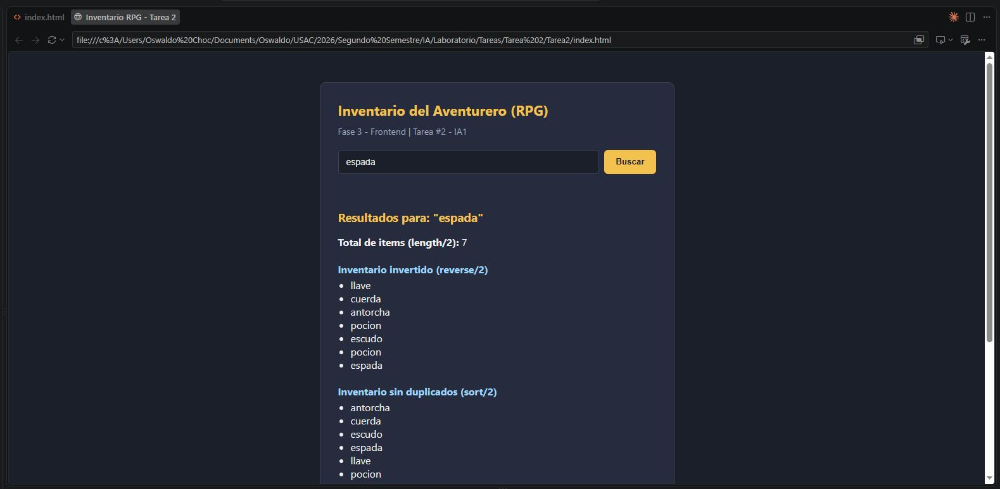
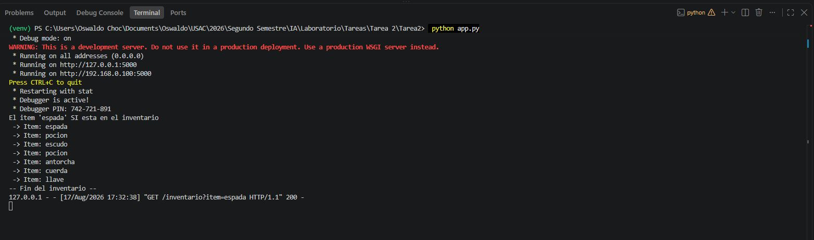

# Tarea #2 - Inventario RPG (Prolog + Python + Frontend)

**Universidad de San Carlos de Guatemala - Facultad de Ingenieria**
**Inteligencia Artificial 1 - Seccion A - Segundo Semestre 2026**

**Estudiante:** Oswaldo Antonio Choc Cuteres
**Carnet:** 201901844

---

## 1. Descripcion general

Sistema de 3 capas para consultar el inventario de un aventurero de RPG:

1. **Prolog** (`inventario.pl`): motor de inferencia con hechos, un predicado
   recursivo y una regla principal que usa `append/3`, `length/2`, `member/2`,
   `reverse/2`, `sort/2` y `msort/2`.
2. **Backend** (`app.py`): API REST en Flask que usa PySwip para consultar
   el motor de Prolog y devuelve un JSON.
3. **Frontend** (`index.html` + `script.js`): interfaz web que consume la API
   y muestra los resultados dinamicamente.

## 2. Flujo tecnico

```
Usuario escribe item en el formulario (frontend)
        |
        v
fetch GET  ->  http://127.0.0.1:5000/inventario?item=<item>
        |
        v
Flask (app.py) recibe el parametro 'item'
        |
        v
PySwip arma la consulta: procesar_inventario('<item>', Total, Invertido, Unico, Ordenado)
        |
        v
Prolog (inventario.pl):
   1. Une items_principales + items_secundarios       -> append/3
   2. Cuenta el total de items                        -> length/2
   3. Invierte el orden de la lista                    -> reverse/2
   4. Genera version sin duplicados                    -> sort/2
   5. Genera version ordenada con duplicados            -> msort/2
   6. Verifica si el item buscado existe                -> member/2
   7. Imprime cada item recursivamente en la consola del servidor
        |
        v
Flask captura las variables unificadas y responde en JSON
        |
        v
Frontend renderiza el resultado en el DOM
```

## 3. Detalle de los hechos y aridad de los metodos

| Elemento | Aridad | Uso en el proyecto |
|---|---|---|
| `items_principales/1` | 1 | Hecho: lista con 4 items, incluye duplicado (`pocion`) |
| `items_secundarios/1` | 1 | Hecho: lista con 3 items distintos |
| `mostrar_inventario/1` | 1 | Predicado recursivo (caso base `[]` + caso recursivo `[H\|T]`) |
| `procesar_inventario/5` | 5 | Regla principal: 1 entrada (ItemBuscado) + 4 salidas por unificacion |
| `append/3` | 3 | Concatena items principales y secundarios |
| `length/2` | 2 | Cuenta el total de items |
| `reverse/2` | 2 | Invierte el orden de la lista |
| `sort/2` | 2 | Ordena y elimina duplicados |
| `msort/2` | 2 | Ordena conservando duplicados |
| `member/2` | 2 | Verifica si el item buscado esta en el inventario |

## 4. Como ejecutar (Windows / PowerShell)

### Requisito previo

- Tener **SWI-Prolog** instalado y accesible en el PATH.
- Tener **Python 3.12** instalado.

### 4.1 Backend

```powershell
cd Tarea2
python -m venv venv
venv\Scripts\Activate.ps1
pip install -r requirements.txt
python app.py
```

El servidor debe quedar escuchando en `http://127.0.0.1:5000`.

### 4.2 Frontend

Abrir el archivo `index.html` directamente en el navegador
(doble clic, o extension "Live Server" en VS Code).

### 4.3 Probar

1. Con el backend corriendo, abrir `index.html` en el navegador.
2. Escribir un item existente, por ejemplo: `espada`, `pocion`, `escudo`,
   `antorcha`, `cuerda` o `llave`.
3. Presionar "Buscar".
4. Revisar en pantalla: total de items, lista invertida, lista sin
   duplicados y lista ordenada con duplicados.
5. Revisar en la consola donde corre `python app.py` la impresion
   recursiva generada por `mostrar_inventario/1`.

## 5. Evidencia funcional (capturas de pantalla)


### 5.1 Captura de la interfaz web con una consulta exitosa




### 5.2 Captura paralela de la consola del backend



### 5.3 Captura de la peticion usada (Network / DevTools)


---

## 6. Estructura de entrega esperada en el repositorio

```
IA1_2026S2_Tareas_A/
└── Tarea2/
    ├── inventario.pl
    ├── app.py
    ├── requirements.txt
    ├── index.html
    ├── script.js
    ├── README.md
    └── evidencia/
        ├── frontend-resultado.png
        ├── backend-consola.png
        └── peticion-api.png
```

